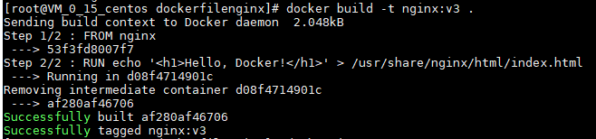

# docker 常用操作指令

 ### 查找镜像
 docker search
 
 拉取镜像
 docker pull

命令格式:
docker pull [选项] [Docker Registry 地址[:端口号]/]仓库名[:标签]

如:docker pull mysql:5.7  

 列出镜像
 
 docker images / docker image ls
 列出某个镜像
 
 docker images mysql:5.7 / docker images ls mysql:5.7
 
 删除镜像
 
 docker images rm
 
 docker image rm [选项] <镜像1> [<镜像2> ...]
 
 如:docker image rm mysql:5.7
 
 Dockerfile 定制镜像
 
 1. 创建文本文件
 
 touch 文件名  如: touch Dockerfile
 
 2. 修改内容文本文件内容
 
 FROM 基础镜像 (必备指令,且必须是第一条指令)
 
 RUN 用于执行命令行命令 --- shell 格式/exec 格式
 
 如: 将 nginx 默认的欢迎页内容改为 hello,docker
 
    
 FROM nginx
 
 RUN echo '<h1>Hello, Docker!</h1>' /usr/share/nginx/html/index.html

 3. 构建镜像
 
 docker build [选项] <上下文路径/URL/->
     
 在 Dockerfile 文件所在目录执行
 
 docker build -t nginx:v3 .
     
 

## docker run

 

