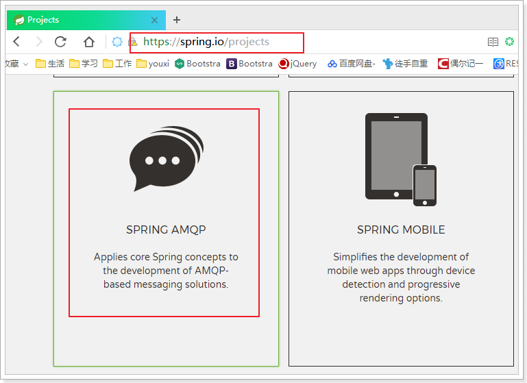
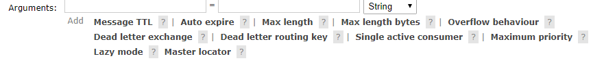
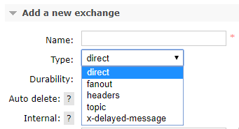
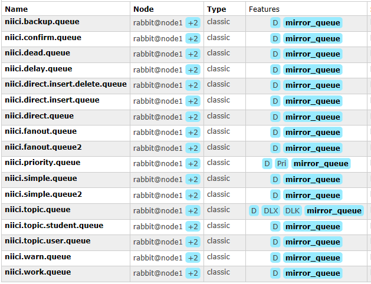
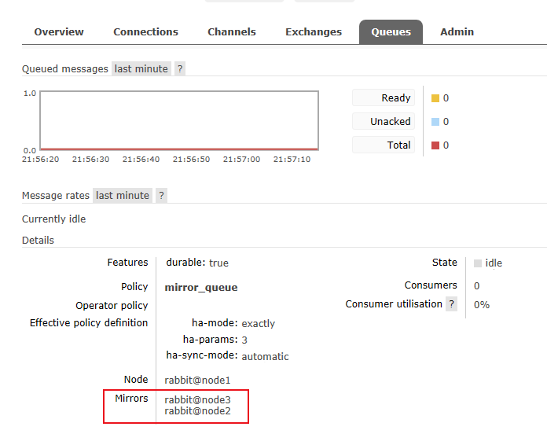

## springboot整合rabbitmq
消息队列是典型的：生产者、消费者模型。生产者不断向消息队列中生产消息，消费者不断的从队列中获取消息。因为消息的生产和消费都是异步的，而且只关心消息的发送和接收，没有业务逻辑的侵入，这样就实现了生产者和消费者的解耦。

**支持作者就Star Mua~**

## RabbitMQ 

RabbitMQ是基于AMQP的一款消息管理系统

官网： http://www.rabbitmq.com/

官方教程：http://www.rabbitmq.com/getstarted.html

## 1.1 下载和安装

详见该项目 rabbitmq 目录下的安装帮助文档:


## Srping AMPQ

Spring有很多不同的项目，其中就有对AMQP的支持: 



Spring AMQP的页面：<http://projects.spring.io/spring-amqp/> 


## 依赖
```xml
 <dependency>
    <groupId>org.springframework.boot</groupId>
    <artifactId>spring-boot-starter-amqp</artifactId>
 </dependency>
```

## 配置 application.yml

````
spring:
  rabbitmq:
    host: 148.70.3.235
    username: niici
    password: niici
    virtual-host: /niici
    template:
        retry:
          #启用重试
          enabled: true
            #第一次重试的间隔时长
          initial-interval: 10000ms
            # 最长重试间隔，超过间隔将不在重试
          max-interval: 210000ms
             # 下次重试间隔的倍数，即下次重试时 间隔时间是上次的几倍
          multiplier: 2
    #生产者确认机制，确保消息会正确发送，如果发送失败会有错误回执，从而触发重试
    publisher-confirms: true
````

在SpringAmqp中，对消息的消费者进行了封装和抽象，一个普通的JavaBean中的普通方法，只要通过简单的注解，就可以成为一个消费者。

```java
@Component
public class Listener {

    @RabbitListener(bindings = @QueueBinding(
            value = @Queue(value = "spring.test.queue", durable = "true"),
            exchange = @Exchange(
                    value = "spring.test.exchange",
                    ignoreDeclarationExceptions = "true",
                    type = ExchangeTypes.TOPIC
            ),
            key = {"#.#"}))
    public void listen(String msg){
        System.out.println("接收到消息：" + msg);
    }
}
```

- `@Componet`：类上的注解，注册到Spring容器
- `@RabbitListener`：方法上的注解，声明这个方法是一个消费者方法，需要指定下面的属性：
  - `bindings`：指定绑定关系，可以有多个。值是`@QueueBinding`的数组。`@QueueBinding`包含下面属性：
    - `value`：这个消费者关联的队列。值是`@Queue`，代表一个队列
    - `exchange`：队列所绑定的交换机，值是`@Exchange`类型
    - `key`：队列和交换机绑定的`RoutingKey`

类似listen这样的方法在一个类中可以写多个，就代表多个消费者。

**详情请查看该项目下的 RebbitMqListener 类**

## 1.2 AmpqTemplate

Spring为AMQP提供了统一的消息处理模板：AmqpTemplate，非常方便的发送消息，其发送方法：


红框圈起来的是比较常用的3个方法，分别是：

- 指定交换机、RoutingKey和消息体
- 指定消息
- 指定RoutingKey和消息，会向默认的交换机发送消息


## 1.3 rabbitmq的五种消息模型

RabbitMQ提供了6种消息模型，但是第6种其实是RPC，并不是MQ，因此不予学习。那么也就剩下5种。
但是其实3、4、5这三种都属于订阅模型，只不过进行路由的方式不同。


### 1.3.1 基本消息模型

 
 
 在上图的模型中，有以下概念：
 
 - P：生产者，也就是要发送消息的程序
 - C：消费者：消息的接受者，会一直等待消息到来。
 - queue：消息队列，图中红色部分。类似一个邮箱，可以缓存消息；生产者向其中投递消息，消费者从其中取出消息。
 
 #### 定义消息生产者
 
 ````
    /**
      * 基本消息模型发送消息
      * @throws InterruptedException
      */
     @Test
     public void  simple() throws InterruptedException {
         String msg = "Rabbitmq simple ....";
         for (int i = 0; i < 10; i++) {
             amqpTemplate.convertAndSend("niici.create.simple.queue",msg);
             Thread.sleep(5000);
         }
     }
````

#### 定义消费者
````
@Component
@Log4j2
public class RabbitMqListener {
    /**
     * 基本消息类型监听
     * @param msg
     * @throws Exception
     */
     @RabbitListener(queuesToDeclare = @Queue(value = "niici.create.simple.queue"))
        public void simpleListener(String msg)throws Exception{
        if (StringUtils.isEmpty(msg)){
            return;
        }
        log.info("SimpleListener listen 接收到消息：" + msg);
    }
}
````

### 1.3.2 消费者的消息确认机制 (AcKnowlage)

消息一旦被消费者接收，队列中的消息就会被删除.

那么问题来了，RabbitMQ 怎么知道消息被接受了呢?

这就要通过消息确认机制（Acknowlege）来实现了。当消费者获取消息后，会向RabbitMQ发送回执ACK，告知消息已经被接收。不过这种回执ACK分两种情况：

- 自动ACK：消息一旦被接收，消费者自动发送ACK
- 手动ACK：消息接收后，不会发送ACK，需要手动调用

这需要看消息的重要性：

- 如果消息不太重要，丢失也没有影响，那么自动ACK会比较方便
- 如果消息非常重要，不容丢失。那么最好在消费完成后手动ACK，否则接收消息后就自动ACK，RabbitMQ就会把消息从队列中删除。如果此时消费者宕机，那么消息就丢失了。

springboot 集成 rabbitmq 的情况下，可以在 application.yml 中设置

````
spring:
  rabbitmq:
    listener:
      direct:
        // 默认为auto 自动ack,manul 为 手动 ack
        acknowledge-mode: manual
      simple:
        acknowledge-mode: manual
````
### 1.3.3 work消息模型

#### 说明

在刚才的基本模型中，一个生产者，一个消费者，生产的消息直接被消费者消费。比较简单。

Work queues，也被称为（Task queues），任务模型。

当消息处理比较耗时的时候，可能生产消息的速度会远远大于消息的消费速度。长此以往，消息就会堆积越来越多，无法及时处理。此时就可以使用work 模型：**让多个消费者绑定到一个队列，共同消费队列中的消息**。队列中的消息一旦消费，就会消失，因此任务是不会被重复执行的。

 

角色：

- P：生产者：任务的发布者
- C1：消费者，领取任务并且完成任务，假设完成速度较慢
- C2：消费者2：领取任务并完成任务，假设完成速度快

面试题：避免消息堆积？

1） 采用workqueue，多个消费者监听同一队列。

2）接收到消息以后，而是通过线程池，异步消费

 #### 定义消息生产者
 ````
    /**
      * work 消息模型发送消息
      * @throws InterruptedException
      */
     @Test
     public void  work() throws InterruptedException {
         String msg = "Rabbitmq work ....";
         for (int i = 0; i < 10; i++) {
             amqpTemplate.convertAndSend("niici.create.work.queue",msg+i);
 
         }
     }
````

 #### 定义消息消费者
 ````
    /**
      * work消息类型监听
      * @param msg
      * @throws Exception
      */
     @RabbitListener(queuesToDeclare =@Queue(value = "niici.create.work.queue"))
     public void workListener1(String msg)throws Exception{
         if (StringUtils.isEmpty(msg)){
             return;
         }
         log.info("WorkListener1 listen 接收到消息：" + msg);
         Thread.sleep(5000);
     }
     
     /**
      * 创建两个 work 队列共同消费
      * @param msg
      * @throws Exception
      */
      @RabbitListener(queuesToDeclare =@Queue(value = "niici.create.work.queue"))
        public void workListener2(String msg)throws Exception{
        if (StringUtils.isEmpty(msg)){
            return;
        }
        log.info("WorkListener2 listen 接收到消息：" + msg);
      }
 ````
 
 ### 1.3.4 持久化
 
 如何避免消息丢失？
 
 1) 消费者的手动ACK机制，可以防止消费者丢失消息
 
 2) 但是，如果在消费者消费之前，MQ就宕机了，消息就没了
 
 如何将消息进行持久化？
 
 要将消息持久化，前提是: 队列、交换机都持久化

### 1.3.5 订阅模型分类

### 1.3.6 订阅模型 - Fanout

Fanout，也称为广播。

#### 流程说明

流程图：


在广播模式下，消息发送流程是这样的：

- 1）  可以有多个消费者
- 2）  每个**消费者有自己的queue**（队列）
- 3）  每个**队列都要绑定到Exchange**（交换机）
- 4）  **生产者发送的消息，只能发送到交换机**，交换机来决定要发给哪个队列，生产者无法决定。
- 5）  交换机把消息发送给绑定过的所有队列
- 6）  队列的消费者都能拿到消息。实现一条消息被多个消费者消费

 #### 定义消息生产者
 
 ````
     /**
      * fantou 广播消息模型发送消息
      * @throws InterruptedException
      */
     @Test
     public void  fanout() throws InterruptedException {
         String msg = "Rabbitmq fanout ....";
         for (int i = 0; i < 10; i++) {
             //广播消息模型是所有队列都能接收到的，所以没有 routeKey，即 为空
             amqpTemplate.convertAndSend("niici.fanout.exchange","",msg+i);
 
             Thread.sleep(5000);
         }
     }
````

 #### 定义消息消费者
 ````
    /**
      * fanout消息类型监听
      * 创建两个fanout 队列 查看是否广播成功
      * @param msg
      * @throws Exception
      */
     @RabbitListener(bindings = @QueueBinding(
             value = @Queue(value = "niici.create.fanout1.queue", durable = "true"),
             exchange = @Exchange(value = "niici.fanout.exchange", ignoreDeclarationExceptions = "true", type = ExchangeTypes.FANOUT))
     )
     public void fanoutListener1(String msg)throws Exception{
         if (StringUtils.isEmpty(msg)){
             return;
         }
         log.info("FanoutListener1 listen 接收到消息：" + msg);
     }
     @RabbitListener(bindings = @QueueBinding(
                 value = @Queue(value = "niici.create.fanout2.queue", durable = "true"),
                 exchange = @Exchange(value = "niici.fanout.exchange", ignoreDeclarationExceptions = "true", type = ExchangeTypes.FANOUT)))
         public void fanoutListener2(String msg)throws Exception{
             if (StringUtils.isEmpty(msg)){
                 return;
             }
         log.info("FanoutListener2 listen 接收到消息：" + msg);
     }
 ````

### 1.3.7 订阅模型 - Direct

在Fanout模式中，一条消息，会被所有订阅的队列都消费。但是，在某些场景下，我们希望不同的消息被不同的队列消费。这时就要用到Direct类型的Exchange。

 在Direct模型下：

- 队列与交换机的绑定，不能是任意绑定了，而是要指定一个`RoutingKey`（路由key）
- 消息的发送方在 向 Exchange发送消息时，也必须指定消息的 `RoutingKey`。
- Exchange不再把消息交给每一个绑定的队列，而是根据消息的`Routing Key`进行判断，只有队列的`Routingkey`与消息的 `Routing key`完全一致，才会接收到消息

流程图：

 

图解：

- P：生产者，向Exchange发送消息，发送消息时，会指定一个routing key。
- X：Exchange（交换机），接收生产者的消息，然后把消息递交给 与routing key完全匹配的队列
- C1：消费者，其所在队列指定了需要routing key 为 error 的消息
- C2：消费者，其所在队列指定了需要routing key 为 info、error、warning 的消息

 #### 定义消息生产者
 ````
     /**
      * direct 广播消息模型发送消息
      *
      * @throws InterruptedException
      */
     @Test
     public void direct() throws InterruptedException {
         for (int i = 0; i < 10; i++) {
             //direct消息模型是所有队列都能接收到的，所以没有 routeKey，即 为空
             amqpTemplate.convertAndSend("niici.direct.exchange", "delete", "删除成功");
             amqpTemplate.convertAndSend("niici.direct.exchange", "insert", "新增成功");
             amqpTemplate.convertAndSend("niici.direct.exchange", "update", "修改成功");
             Thread.sleep(5000);
         }
     }
````

#### 定义消息消费者
 
 ````
    /**
      * direct 消息类型监听
      * @param msg
      * @throws Exception
      */
     @RabbitListener(bindings = @QueueBinding(
             value = @Queue(value = "niici.create.direct.queue", durable = "true"),
             // 交换机默认的是 direct 类型，默认持久化 为 true，所以不用设置
             exchange = @Exchange(value = "niici.direct.exchange", ignoreDeclarationExceptions = "true",type = ExchangeTypes.DIRECT),
             // 指定路由规则
             key = "insert")
     )
     public void directListener(String msg)throws Exception{
         if (StringUtils.isEmpty(msg)){
             return;
         }
         log.info("DirectListener1 listen 接收到消息：" + msg);
     }
````

### 1.3.8 订阅模型 - Topic

#### 说明

`Topic`类型的`Exchange`与`Direct`相比，都是可以根据`RoutingKey`把消息路由到不同的队列。只不过`Topic`类型`Exchange`可以让队列在绑定`Routing key` 的时候使用通配符！


`Routingkey` 一般都是有一个或多个单词组成，多个单词之间以”.”分割，例如： `item.insert`

 通配符规则：

​         `#`：匹配一个或多个词

​         `*`：匹配不多不少恰好1个词

举例：

​         `audit.#`：能够匹配`audit.irs.corporate` 或者 `audit.irs`

​         `audit.*`：只能匹配`audit.irs`

图示：

 

解释：

- 红色Queue：绑定的是`usa.#` ，因此凡是以 `usa.`开头的`routing key` 都会被匹配到
- 黄色Queue：绑定的是`#.news` ，因此凡是以 `.news`结尾的 `routing key` 都会被匹配

 #### 定义消息生产者
 
 ````
    /**
     * topic 消息模型发送消息
     *
     * @throws InterruptedException
     */
    @Test
    public void topic() throws InterruptedException {
        for (int i = 0; i < 10; i++) {
            //广播消息模型是所有队列都能接收到的，所以没有 routeKey，即 为空
            amqpTemplate.convertAndSend("niici.topic.exchange", "user.delete", "user 删除成功");
            amqpTemplate.convertAndSend("niici.topic.exchange", "student.delete", "student 删除成功");
            amqpTemplate.convertAndSend("niici.direct.exchange","niici.insert","新增成功");
            amqpTemplate.convertAndSend("niici.direct.exchange","niici.update","修改成功");
            Thread.sleep(5000);
        }
    }
````

 #### 定义消息消费者

````
    /**
     * topic 消息类型监听
     * @param msg
     * @throws Exception
     */
    @RabbitListener(
            bindings = @QueueBinding(
            value = @Queue(value = "niici.create.topic.queue", durable = "true"),
            exchange = @Exchange(value = "niici.topic.exchange", ignoreDeclarationExceptions = "true", type = ExchangeTypes.TOPIC),
            key = {"user.#"})
    )
    public void topicListener1(String msg )throws Exception{
        if (StringUtils.isEmpty(msg)){
            return;
        }
        log.info("TopicListener1 listen 接收到消息：" + msg);
    }

    /**
     * topic 消息类型监听
     * @param msg
     * @throws Exception
     */
    @RabbitListener(bindings = @QueueBinding(
            value = @Queue(value = "niici.create.topic.queue", durable = "true"),
            exchange = @Exchange(value = "niici.topic.exchange", ignoreDeclarationExceptions = "true", type = ExchangeTypes.TOPIC),
            key = {"student.#"})
    )
    public void topicListener2(String msg )throws Exception{
        if (StringUtils.isEmpty(msg)){
            return;
        }
        log.info("TopicListener2 listen 接收到消息：" + msg);
    }
 ````

#### 如何手动ACK？
#### 说明

`手动ACK`需要在application.yml中配置ack模式为手动, 并配置消息发送失败, 放回队列。
````
listener:
      direct:
        acknowledge-mode: manual
 # 消息发送失败时，返回到队列
publisher-returns: true
````

Code:
````
@RabbitListener(
            bindings = @QueueBinding(
                    value = @Queue(value = "niici.topic.student.queue", durable = "true"),
                    exchange = @Exchange(
                            value = "niici.topic.exchange",
                            ignoreDeclarationExceptions = "true",
                            type = ExchangeTypes.TOPIC
                    ),
                    key = {"student.#"}))
    @RabbitHandler
    public void topicListenAck(String msg, Channel channel, Message message) throws IOException {
        // 消息在队列中对应的索引
        long deliveryTag = message.getMessageProperties().getDeliveryTag();
        try {
            /**
             * 无异常确认消息
             * channel.basicAck(long deliveryTag, boolean multiple);
             * deliveryTag: 取出来的消息在队列中的索引
             * multiple: true表示一次性的将小于deliveryTag的值进行ack
             * 如果当前deliveryTag为5, 则确认5及5之前的消息, 一般为false
             */
            channel.basicAck(deliveryTag, false);
            System.out.println("topic接收到消息：" + msg);
        } catch (IOException e) {
            /**
             * 异常拒收消息
             * basicNack(long deliveryTag, boolean multiple, boolean requeue)
             * requeue: true为将消息返回到队列, 并重新发送给消费者
             *          false则丢弃消息
             */
            channel.basicNack(deliveryTag, false , true);
        }
    }
````


#### 延迟队列
#### 说明

`延迟队列`其实是死信队列在消息超时时的场景。 通过给消息设置超时时间推送到队列的方式来实现。

队列创建参数：x-参数, 如x-message-ttl --- 参数都有哪些？



手动设置消息超时时间带来的问题：消息堆积

Rabbitmq只会检查第一个消息是否过期, 如果第一个消息超时时间较长，第二个消息超时时间较短，则不能实现第二个消息先执行超时，导致消息堆积。

#### 解决方案

使用插件方式来实现延迟队列：rabbitmq_delayed_message_exchange-3.8.0.ez

下载地址：https://www.rabbitmq.com/community-plugins.html

使用方法：

- 将插件拷贝到 `/usr/lib/rabbitmq/lib/rabbitmq_server-3.8.8/plugins/` 目录
- `rabbitmq-plugins enable rabbitmq_delayed_message_exchange`
- 重启rabbitmq服务

重启完成后, 在rabbitmq的交换机页面, 可以看到交换机类型新增了延迟交换机类型

<font color="red">生产者可以直接推送消息到延迟交换机, 由队列通过路由key绑定的方式来实现延迟队列, 无需再指定死信队列</font>




````
[root@node1 ~]# rabbitmq-plugins enable rabbitmq_delayed_message_exchange
Enabling plugins on node rabbit@node1:
rabbitmq_delayed_message_exchange
The following plugins have been configured:
  rabbitmq_delayed_message_exchange
  rabbitmq_management
  rabbitmq_management_agent
  rabbitmq_web_dispatch
Applying plugin configuration to rabbit@node1...
The following plugins have been enabled:
  rabbitmq_delayed_message_exchange

started 1 plugins.
````


Code:

- 声明队列、交换机、绑定关系
````java
    /**
     * 配置延迟交换机
     * @return
     */
    @Bean
    public CustomExchange delayExchange() {
        // CustomExchange 允许自定义交换机类型
        HashMap<String, Object> args = new HashMap<>();
        // 指定延迟队列的类型
        args.put("x-delayed-type", "topic");
        return new CustomExchange("niici.delay.exchange", "x-delayed-message", true, false, args);
    }

    /**
     * 定义一个延迟队列
     * @return
     */
    @Bean
    public Queue delayQueue() {
        return new Queue("niici.delay.queue");
    }

    @Bean
    public Binding delayQueueBind(@Qualifier("delayQueue") Queue queue, @Qualifier("delayExchange") Exchange exchange) {
        // 将队列绑定到指定的交换机上, 并指定路由key
        return BindingBuilder.bind(queue).to(exchange).with("delay.#").noargs();
    }
````

- 生产者
```java
    /**
     * 基于插件的延迟队列测试
     *
     * @throws InterruptedException
     */
    @Test
    public void delay() throws InterruptedException {
        /**
         * 创建两条延迟消息，一条设置5s超时时间，一条设置1s，测试是否1s的消息先被监听到
         */
        amqpTemplate.convertAndSend("niici.delay.exchange", "delay.five", "超时时间5s的消息", message -> {
            message.getMessageProperties().setDelay(5000);
            return message;
        });

        amqpTemplate.convertAndSend("niici.delay.exchange", "delay.one", "超时时间1s的消息", message -> {
            message.getMessageProperties().setDelay(1000);
            return message;
        });
        // 消息发送完成后, 等待10s, 让监听器去监听, 在控制台打印结果
        Thread.sleep(10000);
    }
```

- 消费者
````java
    /**
     * 基于插件的延迟队列监听
     * @param msg
     * @param channel
     * @param message
     * @throws IOException
     */
    @RabbitListener(
            bindings = @QueueBinding(
                    value = @Queue(value = "niici.delay.queue", durable = "true", ignoreDeclarationExceptions = "true"),
                    exchange = @Exchange(
                            value = "niici.delay.exchange",
                            ignoreDeclarationExceptions = "true",
                            type = ExchangeTypes.TOPIC
                    ),
                    key = {"delay.#"}))
    @RabbitHandler
    public void delayListen(String msg, Channel channel, Message message) throws IOException {
        // 消息在队列中对应的索引
        long deliveryTag = message.getMessageProperties().getDeliveryTag();
        try {
            System.out.println("基于插件的延迟队列监听器到消息: " + msg);
            channel.basicAck(deliveryTag, false);
        } catch (IOException e) {
            channel.basicNack(deliveryTag, false, true);
        }
    }
````

- 结果
  
  基于插件的延迟队列监听器到消息: 超时时间1s的消息
  
  基于插件的延迟队列监听器到消息: 超时时间5s的消息

### <font color="red">幂等性</font>


#### 解决方案：

MQ消费者的幂等性的解决一般使用全局ID或者写一个唯一标识比如时间戳、UUID
或者可按自己的规则生成一个全局唯一id，每次消费消息时用该id先判断消息是否已消费过。

#### 消费端的幂等性保障

在海量订单生成的业务高峰期, 生产者可能会重复发送消息, 这时消费端就需要实现幂等性，
这就意味着消息永远不能被消费多次，即使收到了一样的消息。

<font color="red">业界主流的幂等性有两种操作：
- 唯一ID + 指纹码机制, 利用数据库主键去重
- 利用redis的原子性去实现
  </font>


#### 利用Redis的原子性实现

利用redis执行setnx命令, 天然具备幂等性, 从而实现不重复消费。


### <font color="red">集群搭建</font>

#### 环境准备
已启动三个节点的rabbitmq-server

#### 搭建流程
- 修改三个节点的hosts文件
````shell
    vim /etc/hosts
    192.168.18.164 node1
    192.168.18.165 node2
    192.168.18.166 node3
````
- 确认每个节点的cookie文件相同
```shell
    scp /var/lib/rabbitmq/.erlang.cookie root@node2:/var/lib/rabbitmq/.erlang.cookie
    scp /var/lib/rabbitmq/.erlang.cookie root@node3:/var/lib/rabbitmq/.erlang.cookie
```
- 启动 RabbitMQ 服务,顺带启动 Erlang 虚拟机和 RbbitMQ 应用服务(在三台节点上分别执行以
  下命令)
```shell
    rabbitmq-server -detached
```
- 在节点2执行
```shell
    rabbitmqctl stop_app (rabbitmqctl stop 会将 Erlang 虚拟机关闭, rabbitmqctl stop_app 只关闭 RabbitMQ 服务)
    rabbitmqctl reset
    rabbitmqctl join_cluster rabbit@node1
    rabbitmqctl start_app (只启动应用服务)
```
- 在节点3执行
```shell
    rabbitmqctl stop_app
    rabbitmqctl reset
    rabbitmqctl join_cluster rabbit@node1
    rabbitmqctl start_app
```
- 查看集群状态(例子供参考)
```shell
    rabbitmqctl cluster_status
    [root@node3 ~]# rabbitmqctl cluster_status
    Cluster status of node rabbit@node3 ...
    Basics
    
    Cluster name: rabbit@node1
    
    Disk Nodes
    
    rabbit@node1
    rabbit@node2
    rabbit@node3
    
    Running Nodes
    
    rabbit@node1
    rabbit@node2
    rabbit@node3
    
    Versions
    
    rabbit@node1: RabbitMQ 3.8.8 on Erlang 21.3
    rabbit@node2: RabbitMQ 3.8.8 on Erlang 21.3
    rabbit@node3: RabbitMQ 3.8.8 on Erlang 21.3
    
    Maintenance status
    
    Node: rabbit@node1, status: not under maintenance
    Node: rabbit@node2, status: not under maintenance
    Node: rabbit@node3, status: not under maintenance
    
    Alarms
    
    (none)
    
    Network Partitions
    
    (none)
    
    Listeners
    
    Node: rabbit@node1, interface: [::], port: 15672, protocol: http, purpose: HTTP API
    Node: rabbit@node1, interface: [::], port: 25672, protocol: clustering, purpose: inter-node and CLI tool communication
    Node: rabbit@node1, interface: [::], port: 5672, protocol: amqp, purpose: AMQP 0-9-1 and AMQP 1.0
    Node: rabbit@node2, interface: [::], port: 25672, protocol: clustering, purpose: inter-node and CLI tool communication
    Node: rabbit@node2, interface: [::], port: 15672, protocol: http, purpose: HTTP API
    Node: rabbit@node2, interface: [::], port: 5672, protocol: amqp, purpose: AMQP 0-9-1 and AMQP 1.0
    Node: rabbit@node3, interface: [::], port: 25672, protocol: clustering, purpose: inter-node and CLI tool communication
    Node: rabbit@node3, interface: [::], port: 15672, protocol: http, purpose: HTTP API
    Node: rabbit@node3, interface: [::], port: 5672, protocol: amqp, purpose: AMQP 0-9-1 and AMQP 1.0
    
    Feature flags
    
    Flag: drop_unroutable_metric, state: enabled
    Flag: empty_basic_get_metric, state: enabled
    Flag: implicit_default_bindings, state: enabled
    Flag: maintenance_mode_status, state: enabled
    Flag: quorum_queue, state: enabled
    Flag: virtual_host_metadata, state: enabled
```
- 重新设置用户
```shell
    rabbitmqctl add_user admin admin
    rabbitmqctl set_user_tags admin administrator
    rabbitmqctl set_permissions -p "/" admin ".*" ".*" ".*"
```
- 解除集群节点
```shell
    rabbitmqctl stop_app
    rabbitmqctl reset
    rabbitmqctl start_app
    rabbitmqctl cluster_status
    rabbitmqctl forget_cluster_node rabbit@node2(node1 机器上执行)
    rabbitmqctl forget_cluster_node rabbit@node3(node1 机器上执行)
```

### <font color="red">镜像队列</font>
引入镜像队列(Mirror Queue)的机制，可以将队列镜像到集群中的其他 Broker 节点之上，如果集群中
的一个节点失效了，队列能自动地切换到镜像中的另一个节点上以保证服务的可用性。


- 命令行配置方式
```shell
    rabbitmqctl set_policy [-p Vhost] Name Pattern Definition [Priority]
    
    -p Vhost: 可选参数, 针对指定vhost下的queue进行设置
    Name: policy的名称
    Pattern: queue的匹配模式(正则表达式)
    Definition: 镜像定义, 包括三个部分ha-mode, ha-params, ha-sync-mode
        ha-mode: 指明镜像队列的模式, 有效值为 all/exactly/nodes
            all: 表示在集群中所有的节点上进行镜像
            exactly: 表示在指定个数的节点上进行镜像, 节点的个数由ha-params指定
            nodes: 表示在指定的节点上进行镜像, 节点名称通过ha-params指定
        ha-params: ha-mode模式需要用到的参数
        ha-sync-mode: 进行队列中消息的同步方式, 有效值为automatic和manual
        priority: 可选参数, policy的优先级        
```

```shell
    rabbitmqctl set_policy --priority 0 --apply-to queues mirror_queue "niici.*" '{"ha-mode":"exactly","ha-params":3,"ha-sync-mode":"automatic"}'
```

#### 执行结果



### 高可用负载均衡
