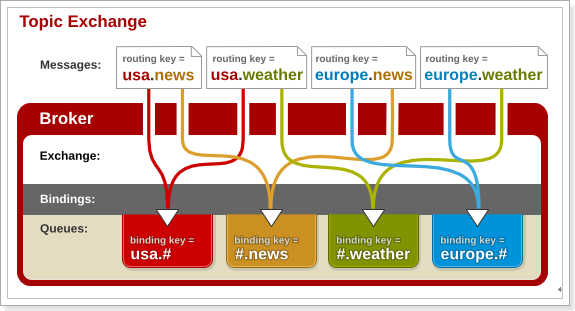

## springboot整合rabbitmq
消息队列是典型的：生产者、消费者模型。生产者不断向消息队列中生产消息，消费者不断的从队列中获取消息。因为消息的生产和消费都是异步的，而且只关心消息的发送和接收，没有业务逻辑的侵入，这样就实现了生产者和消费者的解耦。

**支持作者就Star Mua~**

## RabbitMQ 

RabbitMQ是基于AMQP的一款消息管理系统

官网： http://www.rabbitmq.com/

官方教程：http://www.rabbitmq.com/getstarted.html

## 1.1 下载和安装

详见该项目 rabbitmq 目录下的安装帮助文档:


## 1.2 rabbitmq的五种消息模型

RabbitMQ提供了6种消息模型，但是第6种其实是RPC，并不是MQ，因此不予学习。那么也就剩下5种。
但是其实3、4、5这三种都属于订阅模型，只不过进行路由的方式不同。


### 1.2.1 基本消息模型

 
 
 在上图的模型中，有以下概念：
 
 - P：生产者，也就是要发送消息的程序
 - C：消费者：消息的接受者，会一直等待消息到来。
 - queue：消息队列，图中红色部分。类似一个邮箱，可以缓存消息；生产者向其中投递消息，消费者从其中取出消息。

### 1.2.2 消费者的消息确认机制 (AcKnowlage)

消息一旦被消费者接收，队列中的消息就会被删除.

那么问题来了，RabbitMQ 怎么知道消息被接受了呢?

这就要通过消息确认机制（Acknowlege）来实现了。当消费者获取消息后，会向RabbitMQ发送回执ACK，告知消息已经被接收。不过这种回执ACK分两种情况：

- 自动ACK：消息一旦被接收，消费者自动发送ACK
- 手动ACK：消息接收后，不会发送ACK，需要手动调用

这需要看消息的重要性：

- 如果消息不太重要，丢失也没有影响，那么自动ACK会比较方便
- 如果消息非常重要，不容丢失。那么最好在消费完成后手动ACK，否则接收消息后就自动ACK，RabbitMQ就会把消息从队列中删除。如果此时消费者宕机，那么消息就丢失了。

### 1.2.3 work消息模型

### 1.2.4 订阅模型分类

### 1.2.5 订阅模型 - Fanout

Fanout，也称为广播。

#### 流程说明

流程图：


在广播模式下，消息发送流程是这样的：

- 1）  可以有多个消费者
- 2）  每个**消费者有自己的queue**（队列）
- 3）  每个**队列都要绑定到Exchange**（交换机）
- 4）  **生产者发送的消息，只能发送到交换机**，交换机来决定要发给哪个队列，生产者无法决定。
- 5）  交换机把消息发送给绑定过的所有队列
- 6）  队列的消费者都能拿到消息。实现一条消息被多个消费者消费

### 1.2.6 订阅模型 - Direct

在Fanout模式中，一条消息，会被所有订阅的队列都消费。但是，在某些场景下，我们希望不同的消息被不同的队列消费。这时就要用到Direct类型的Exchange。

 在Direct模型下：

- 队列与交换机的绑定，不能是任意绑定了，而是要指定一个`RoutingKey`（路由key）
- 消息的发送方在 向 Exchange发送消息时，也必须指定消息的 `RoutingKey`。
- Exchange不再把消息交给每一个绑定的队列，而是根据消息的`Routing Key`进行判断，只有队列的`Routingkey`与消息的 `Routing key`完全一致，才会接收到消息

流程图：

 

图解：

- P：生产者，向Exchange发送消息，发送消息时，会指定一个routing key。
- X：Exchange（交换机），接收生产者的消息，然后把消息递交给 与routing key完全匹配的队列
- C1：消费者，其所在队列指定了需要routing key 为 error 的消息
- C2：消费者，其所在队列指定了需要routing key 为 info、error、warning 的消息

### 1.2.7 订阅模型 - Topic

#### 说明

`Topic`类型的`Exchange`与`Direct`相比，都是可以根据`RoutingKey`把消息路由到不同的队列。只不过`Topic`类型`Exchange`可以让队列在绑定`Routing key` 的时候使用通配符！


`Routingkey` 一般都是有一个或多个单词组成，多个单词之间以”.”分割，例如： `item.insert`

 通配符规则：

​         `#`：匹配一个或多个词

​         `*`：匹配不多不少恰好1个词

举例：

​         `audit.#`：能够匹配`audit.irs.corporate` 或者 `audit.irs`

​         `audit.*`：只能匹配`audit.irs`

图示：

 

解释：

- 红色Queue：绑定的是`usa.#` ，因此凡是以 `usa.`开头的`routing key` 都会被匹配到
- 黄色Queue：绑定的是`#.news` ，因此凡是以 `.news`结尾的 `routing key` 都会被匹配

### 1.3 持久化

如何避免消息丢失？

1) 消费者的手动ACK机制，可以防止消费者丢失消息

2) 但是，如果在消费者消费之前，MQ就宕机了，消息就没了

如何将消息进行持久化？

要将消息持久化，前提是: 队列、交换机都持久化

## Srping AMPQ

Sprin有很多不同的项目，其中就有对AMQP的支持: 


Spring AMQP的页面：<http://projects.spring.io/spring-amqp/> 


## 依赖
```xml
 <dependency>
    <groupId>org.springframework.boot</groupId>
    <artifactId>spring-boot-starter-amqp</artifactId>
 </dependency>
```

在SpringAmqp中，对消息的消费者进行了封装和抽象，一个普通的JavaBean中的普通方法，只要通过简单的注解，就可以成为一个消费者。

```java
@Component
public class Listener {

    @RabbitListener(bindings = @QueueBinding(
            value = @Queue(value = "spring.test.queue", durable = "true"),
            exchange = @Exchange(
                    value = "spring.test.exchange",
                    ignoreDeclarationExceptions = "true",
                    type = ExchangeTypes.TOPIC
            ),
            key = {"#.#"}))
    public void listen(String msg){
        System.out.println("接收到消息：" + msg);
    }
}
```

- `@Componet`：类上的注解，注册到Spring容器
- `@RabbitListener`：方法上的注解，声明这个方法是一个消费者方法，需要指定下面的属性：
  - `bindings`：指定绑定关系，可以有多个。值是`@QueueBinding`的数组。`@QueueBinding`包含下面属性：
    - `value`：这个消费者关联的队列。值是`@Queue`，代表一个队列
    - `exchange`：队列所绑定的交换机，值是`@Exchange`类型
    - `key`：队列和交换机绑定的`RoutingKey`

类似listen这样的方法在一个类中可以写多个，就代表多个消费者。

